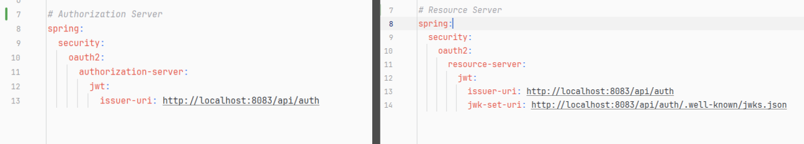

### Authorization server and Resource server


# JWT Signing and Verification Explained Simply

## Private Key Signing (When Creating a JWT)

### Issuer Has Two Keys:
- A private key (kept secret)
- A public key (shared with everyone)

### Signing Process:
1. The issuer creates the JWT (header + payload)
2. They use the private key to create a unique "signature" (like a fingerprint)
3. This signature is mathematically tied to both:
    - The JWT content (header + payload)
    - The private key

### Result:
- The final JWT has three parts: `header.payload.signature`
- Only someone with the private key could have created this exact signature.

---

## Public Key Verification (When Checking a JWT)

### Getting the Public Key:
- Your application fetches the issuer's public key (from JWKS endpoint)
- This public key is like a special decoder ring that matches the private key.

### Verification Process:
Your system:
1. Takes the JWT's header + payload
2. Takes the signature
3. Uses the public key to check if they match mathematically

If they match perfectly, it proves:
- The JWT wasn't tampered with (content is unchanged)
- It was definitely signed by someone with the matching private key

---

## Simple Analogy

# 🧙‍♂️ Magic of JWT Signature Verification (Wax Seal Analogy)

## 🕯️ Imagine:

- 🔐 **Private key** = Your unique **wax seal stamp** *(only you have it)*
- 🧾 **Public key** = The **impression** of your seal that everyone can examine
- 📝 **Signing** = You **stamp a document** with your wax seal
- 🔍 **Verifying** = Others **check if the wax seal** matches your known seal impression

## ✨ The Magic

While **anyone can verify** with the public key 🧾🔍,  
**only you** could have **created the original signature** using your **private key** 🔐🕯️.

---


# 🔐 Correct Analogy: One-Way Mathematical Lock

## 🔑 Key Concepts

- 🖊️ **Private Key** = Your unique pen that can write in special ink
- 🔍 **Public Key** = A special magnifying glass that can ONLY verify the ink's authenticity
- ✍️ **Signature** = Your handwritten signature using that special pen

## ❓ Why Can't Others "Steal" Info?

- 🔍 The public key (magnifying glass) can only check if the signature matches the private key's ink.
- 🚫 It **cannot reverse-engineer** the private key or decode anything.
- 📄 JWTs are already readable by anyone (header + payload are just base64-encoded text).
- ✅ The signature only proves who created it.

---

## 🧮 Real-World Math Behind It

Private keys use **asymmetric cryptography** (like RSA or ECDSA):

- ⚙️ Easy to compute signature with private key
- 🛑 Impossible to compute private key from public key (would take billions of years)

### 🧪 Example Verification Steps

```python
# Pseudo-code
if verify(public_key, jwt.header + jwt.payload, jwt.signature):
    print("✅ Genuine!")  # Only possible if signed by matching private key
else:
    print("⚠️ Tampered!")
```

---

## 🕵️‍♂️ What Could Actually Be Stolen?

If attackers get your **private key**, they can forge tokens. That’s why you must:

- ❌ Never share private keys
- 🔁 Use JWKS endpoints to rotate keys periodically
- 🏦 Keep private keys in secure storage (HSM, vault, etc.)

🔓 **Public keys are safe to share by design**—they’re like padlocks where anyone can lock, but only you can unlock. 🔐

---
## JWT Authentication Guide

For detailed information on how JWT authentication is handled, please refer to the [JWT Authentication Guide](jwks.md).

